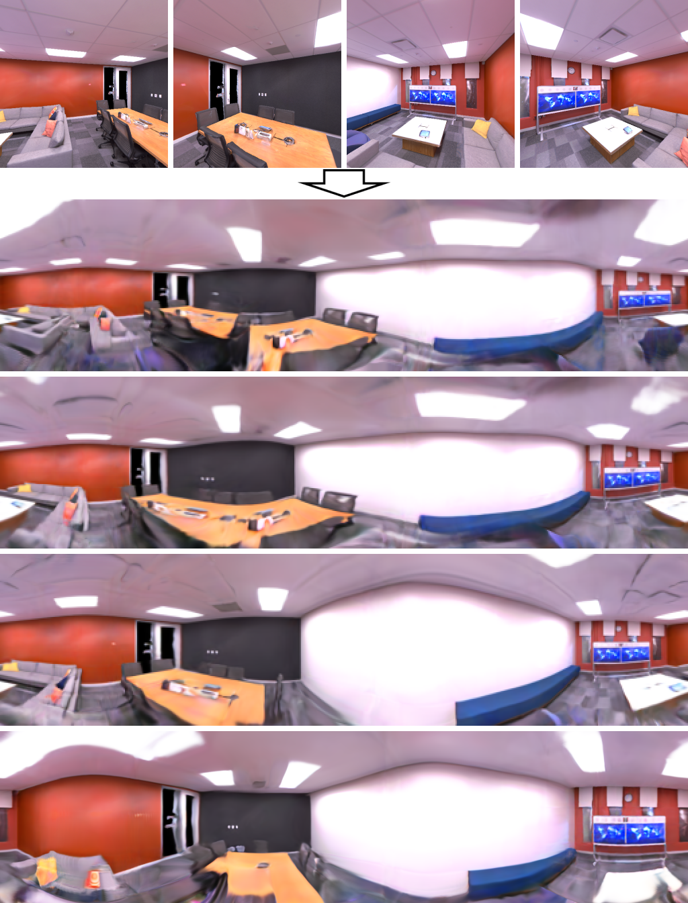

## SinGRAF: Learning a 3D Generative Radiance Field for a Single Scene

Official PyTorch Implementation of SinGRAF (CVPR2023)   
**[Project Page](https://www.computationalimaging.org/publications/singraf/) | [Paper](https://arxiv.org/abs/2211.17260) | [Code](https://github.com/SAITPublic/SinGRAF) | [Video](https://www.youtube.com/watch?v=Mmz_kloOcN4)**

   

**SinGRAF: Learning a 3D Generative Radiance Field for a Single Scene, CVPR2023**   
**[Minjung Son](https://sites.google.com/site/sionson)\*<sup>12</sup>, [Jeong Joon Park](https://jjparkcv.github.io/)\*<sup>2</sup>, [Leonidas Guibas](https://geometry.stanford.edu/member/guibas/index.html)<sup>2</sup>, [Gordon Wetzstein](https://stanford.edu/~gordonwz/)<sup>2</sup>**   
<sup>1</sup>*Samsung Advanced Institute of Technology (SAIT)*, <sup>2</sup>*Stanford University*

> Generative models have shown great promise in synthesizing photorealistic 3D objects, but they require large amounts of training data. 
We introduce SinGRAF, a 3D-aware generative model that is trained with a few input images of a single scene. 
Once trained, SinGRAF generates different realizations of this 3D scene that preserve the appearance of the input while varying scene layout. 
For this purpose, we build on recent progress in 3D GAN architectures and introduce a novel progressive-scale patch discrimination approach during training. 
With several experiments, we demonstrate that the results produced by SinGRAF outperform the closest related works in both quality and diversity by a large margin.


## Preparation

1. Download additional codes from [GSN](https://github.com/apple/ml-gsn/tree/main/models/op) to the corresponding path (```[path/to/SinGRAF]/models/op```)

2. Download [scene data](https://drive.google.com/uc?id=1o24GuYtAuVNDZqxKD2Wri_lPvvA4mCDE&export=download) and extract them to ```[path/to/SinGRAF]/data```

3. Set envirentment (tested on virtual environment with python3.7)
```
pip install torch==1.10.0+cu102 torchvision==0.11.1+cu102 -f https://download.pytorch.org/whl/cu102/torch_stable.html
pip install -r requirements.txt
```


## Training


#### Example training for office_3
```
CUDA_VISIBLE_DEVICES=0 python train_singraf.py --base_config 'configs/models/singraf_tri_scene_config.yaml' --log_dir 'logs/office_3' data_config.data_dir='data/replica/office_3'
```
> Input images: ```[path/to/SinGRAF]/data/replica/office_3/train/```   
> Output: ```[path/to/SinGRAF]/logs/office_3/```   


#### Example training for dynamic scene (frl_apartment scenes with 5 different configurations)
```
CUDA_VISIBLE_DEVICES=0 python train_singraf.py --base_config 'configs/models/singraf_tri_scene_config_dynamic.yaml' --log_dir 'logs/frl_apartment_dynamic' data_config.data_dir='data/replica/frl_apartment'
```
> Input images: ```[path/to/SinGRAF]/data/replica/frl_apartment/train/```   
> Output: ```[path/to/SinGRAF]/logs/frl_apartment_dynamic/```   


#### Example training for casually-captured in-the-wild scene (garden2)
```
CUDA_VISIBLE_DEVICES=0 python train_singraf.py --base_config 'configs/models/singraf_tri_scene_config_wild.yaml' --log_dir 'logs/garden2' data_config.data_dir='data/garden2'
```
> Input images: ```[path/to/SinGRAF]/data/garden2/train/```   
> Output: ```[path/to/SinGRAF]/logs/garden2/```


## Visualization
Example visualization for trained office_3
```
CUDA_VISIBLE_DEVICES=0 python val_singraf.py office_3
```
> Input trained model: ```[path/to/SinGRAF]/logs/office_3/checkpoints/last.ckpt```   
> Output: ```[path/to/SinGRAF]/vals/office_3/[epoch]/```   


## Evaluation

1. Download [clean-fid](https://github.com/GaParmar/clean-fid) and [PerceptualSimilarity](https://github.com/richzhang/PerceptualSimilarity) codes for KID and LPIPS calculation

2. Generate links to the downloaded codes
```
ln -s [path/to/clean-fid]/cleanfid [path/to/SinGRAF]/cleanfid
ln -s [path/to/PerceptualSimilarity]/lpips [path/to/SinGRAF]/lpips
```

3. Generate result images and run evaluation   
Ex. evaluation for trained office_3
```
CUDA_VISIBLE_DEVICES=0 python eval_singraf.py office_3
```
> Input trained model: ```[path/to/SinGRAF]/logs/office_3/checkpoints/last.ckpt```   
> Input sampled GT images for KID: ```[path/to/SinGRAF]/data/replica/office_3/eval/```   
> Output: ```[path/to/SinGRAF]/evals/office_3/[epoch]/```   


## Citation
```
@inproceedings{son2023singraf,
    title={SinGRAF: Learning a 3D Generative Radiance Field for a Single Scene},
    author={Minjung Son and Jeong Joon Park and Leonidas Guibas and Gordon Wetzstein},
    booktitle={CVPR},
    year={2023}
}
```

## Acknowledgements
This project is based on other open-source libraries.
We specially thank the authors of [GSN](https://github.com/apple/ml-gsn) for releasing their wonderful codes.
